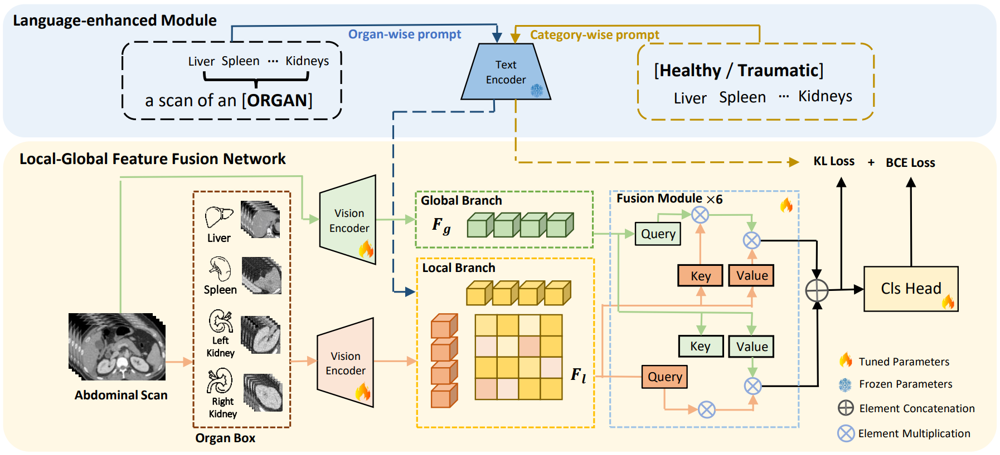

# Language-Enhanced Local-Global Aggregation Network for Multi-Organ Trauma Detection

## Introduction
Pytorch implementation for MICCAI 2024 paper **[Language-Enhanced Local-Global Aggregation Network for Multi-Organ Trauma Detection
](https://github.com/Jianxun98/TraumaDet/)**

<p align="center">

</p>

> Abdominal trauma is one of the leading causes of death in the elderly population and increasingly poses a global challenge. However, interpreting CT scans for abdominal trauma is considerably challenging for deep learning models. Trauma may exist in various organs presenting different shapes and morphologies. In addition, a thorough comprehension of visual cues and various types of trauma is essential, demanding a high level of domain expertise. To address these issues, this paper introduces a language-enhanced local-global aggregation network that aims to fully utilize both global contextual information and local organ-specific information inherent in images for accurate trauma detection. Furthermore, the network is enhanced by text embedding from Large Language Models (LLM). This LLM-based text embedding possesses substantial medical knowledge, enabling the model to capture anatomical relationships of intra-organ and intra-trauma connections. We have conducted experiments on one public dataset of RSNA Abdominal Trauma Detection (ATD) and one in-house dataset. Compared with existing state-of-the-art methods, the F1-score of organ-level trauma detection improves from 51.4\% to 62.5\% when evaluated on the public dataset and from 61.9\% to 65.2\% on the private cohort, demonstrating the efficacy of our proposed approach for multi-organ trauma detection.

## Usage

### Setup
```bash
Package                Version
---------------------- -------------------
einops                 0.7.0
monai                  1.3.0
nibabel                5.2.1
numpy                  1.23.5
pandas                 2.0.3
positional_encodings   6.0.3
scikit_learn           1.3.2
scipy                  1.13.0
SimpleITK              2.3.1
torch                  2.1.2
torchvision            0.16.2
```

### Preliminary
#### Pre-train
Our local vision encoder use pre-trained weights [[link](https://www.dropbox.com/s/lyunaue0wwhmv5w/unet.pth)] in **[CLIP-Driven Universal Model](https://github.com/ljwztc/CLIP-Driven-Universal-Model)**. Please download it before running the code.

[1] J. Liu, Y. Zhang, J. Chen, J. Xiao, Y. Lu, B. Landman, Y. Yuan, A. Yuille, Y. Tang, and Z. Zhou. Clip-driven universal model for organ segmentation and tumor detection. In Proceedings of the
IEEE/CVF International Conference on Computer Vision, pages 21152–21164, 2023.
#### Text Embedding
Our used text embeddings consists of **Organ-wise Prompt** and **Category-wise Prompt** embeddings. Please download them at appropriate stages.
##### Organ-wise Prompt (Used In Training and Inference Stages)
The organ-wise prompt is used in training and inference stages, it is composed of specific organ names with the medical template, as shown in the main figure.
| Types | Download |
| ----  |  ----  |
| Organs  | [link](https://www.dropbox.com/scl/fi/lkkfucxbbv355nou4qy0v/four_organ.pth?rlkey=m7o8bnngmcee83o2y17yrog4u&st=6jb9nbvj&dl=0) |
##### Category-wise Prompt (Used in Training Stage)
The category-wise prompt is exclusively involved in the training process to guide the predictions, it's generated according to the label and has a similar template to the organ-wise prompt. We test three types of prompts: Fine-grained, Position, and Category, which are listed below. We select the Category type prompt finally, as shown in the main Figure.
| Types | Download |
| ----  |  ----  |
| Fine-grained  | [link](https://www.dropbox.com/scl/fi/q3o4r9g3lbqpvc6mdapm8/fine_grained.pth?rlkey=2fh6sdef8pk738zsgvf641irh&st=lkr49r93&dl=0) |
| Position | [link](https://www.dropbox.com/scl/fi/fr1ywmu3m6p8y3ktcodfc/Trauma_Position.pth?rlkey=tr4aa07jni28cwgp9bdwnwx43&st=bmhvbijs&dl=0) |
| Category | [link](https://www.dropbox.com/scl/fi/nl9zqc5vmepco60o8thgw/Trauma_Label.pth?rlkey=u0ojv4ljtw8qzjtsy5h16gnp2&st=u7xizdhg&dl=0) |

If you want to design your own prompts, you can follow the text encoding method (e.g. **[CLIP-Driven Universal Model](https://github.com/ljwztc/CLIP-Driven-Universal-Model)**)

### Data preparing
#### 1. Download the RSNA-ATD dataset: https://www.kaggle.com/competitions/rsna-2023-abdominal-trauma-detection/data.
#### 2. Transfer multiple 2D dicom images of the same case to 3D Nifti volumes.
```bash 
python dicom2nii.py
```
#### 3. Train a segmentation model (e.g. **[TransUnet](https://github.com/Beckschen/TransUNet)**) to obtain all segmentation maps of organs.
[2] J. Chen, Y. Lu, Q. Yu, X. Luo, E. Adeli, Y. Wang, L. Lu, A. Yuille, and Y. Zhou. Transunet: Transformers make strong
encoders for medical image segmentation. arXiv preprint arXiv:2102.04306, 2021.
#### 4. Data preprocessing
```bash
python monai_preprocessing.py
```
#### 5. Extract Organ boxes
```bash
python crop_to_size.py
```
#### 6. Sort out documents. Put all the preprocessed data and .pth files like this:
```bash
.
├── code
│   ├── dataset
│   ├── models
│   ├── runs
│   │   └── our_checkpoints
│   ...
│   ├── label.csv
│   ├── train_data.txt
│   ├── val_data.txt
│   ├── test_data.txt 
│   ├── unet.pth (pre-trained weights)
│   ├── four_organ.pth (organ-wise prompt embedding)
│   └── Trauma_Label.pth (category-wise prompt embedding)
└── preprocessed_data
    └──Global_method
    │   ├── Patient-1.npz
    │   └── *.npz
    └──Local_method 
        ├── Patient-1.npz
        └── *.npz
```

### Training
```bash
python GLFF_train.py --model_name local_prompt_global_prompt --alfa 0.9 --prompt_loss True
```
### Testing
If you want to reproduce our experiment result, you can use our model weights [[link](https://www.dropbox.com/scl/fo/xeql0l62437o67otdprhh/AI225To5VBSlwGjVSwX9qlA?rlkey=wjkyvg1t3970qf9lffunarw5j&st=5z991owg&dl=0)], and run the command below:
```bash
python inference_global_local.py --model_name local_prompt_global_prompt \
--model_path "./runs/our_checkpoints/model_best.pt" \
--local_path "/research/d1/rshr/qxhu/PublicDataset/Jianxun/our_methods" \
--global_path "/research/d1/rshr/qxhu/PublicDataset/Jianxun/baseline_methods" \
--label_path "./label.csv" \
--test_list "./test_data.txt"
```
## Citation
If this repository is useful for your research, please cite:
```
@article{yu2024lelgan,
     title={Language-Enhanced Local-Global Aggregation Network for Multi-Organ Trauma Detection},
     author={Yu, Jianxun and Hu, Qixin and Jiang, Meirui and Wang, Yaning and Wong, Chin Ting and Wang, Jing and Zhang, Huimao and Dou, Qi},
     journal={International Conference on Medical Image Computing and Computer Assisted Intervention},
     year={2024}
   }
```  
### Contact
For any questions, please contact ‘jianxyu98@gmail.com’
